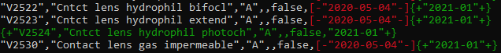

# Panther Usage

## How to create a new package, schedule it for Panther upgrade-based deployment, and how to deploy it manually.

### Source data

Source data may be found by downloading the latest "Schedule B" from https://www.cms.gov/Medicare/Medicare-Fee-for-Service-Payment/HospitalOutpatientPPS/Addendum-A-and-Addendum-B-Updates

### Create new package
* Download and unzip scheduleB data
* Run [samples.ps1](./samples.ps1).  Verify the output looks correct and commit/push the results.  You may find these commands useful to compare the CSV file differences.
    * Before committing: `git diff --word-diff-regex="[^,]+" -- *csv`
    * QA latest commit: `git show head --word-diff-regex="[^,]+" -- *csv`
    * 
* Make a copy of the file and give it a case-sensitive name PaymentSchedule.2020-04.json that alphanumerically and unambiguously sorts so that the file matching `PaymentSchedule.*.json` is the file the web server reads.

### Schedule Install/Upgrade
* Optionally add the file to Panther.Server.Installer in the [bulk data Seed\hcpcs section](https://github.com/softek/panther/tree/ui/main/src/deployment/Panther.Server.Installer/Seed/hcpcs) and delete the old file that should no longer be deployed. heat.exe should automatically reflect the added and remove files in a generated .wxs file.

### Deploy a package w/o software upgrade
Deploy to the Panther servers that need the new file before their next software upgrade.

1. Take the file created in the previous step and copy it to the BulkData folder (usually C:\Program Files\Softek Solutions\Panther Server\BulkData\)
2. Sort by filename.  The file should be the last PaymentSchedule*JSON file.
3. Make sure it took effect by opening the Formulary Compliance control and hovering over the PaymentRate and StatusIndicators.  Find one of the updated HCPCS codes and see that the "source" looks correct in the tooltip.
